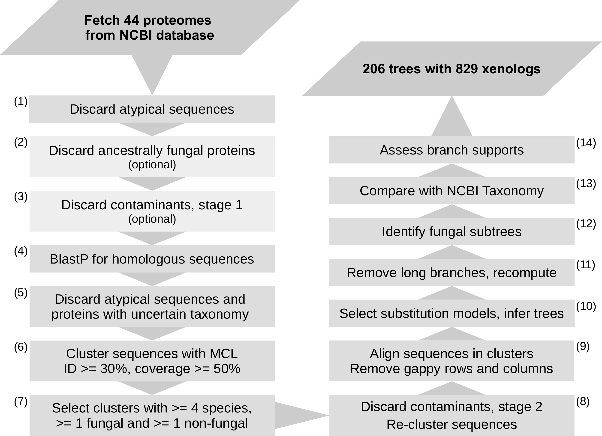

# HGTin44EDF
Horizontal Gene Transfer in 44 Early Diverging Fungi

This repository contains a detailed description of the pipeline from (Ciach et al., 2023) to detect horizontally transfered protein-encoding genes in a set of proteomes.    
The individual steps are described below. The repository also contains necessary Jupyter Notebooks and Python3 scripts to perform the analysis.  

 

 
# Pipeline steps

*TBD*

