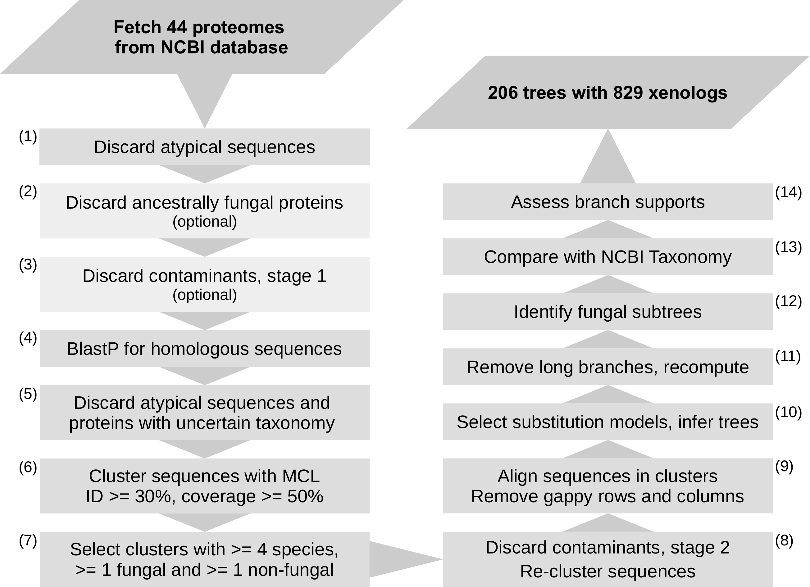

# HGTin44EDF
Horizontal Gene Transfer in 44 Early Diverging Fungi

This repository contains a detailed description of the pipeline from (Ciach et al., 2023) to detect horizontally transfered protein-encoding genes in a set of proteomes.    
The individual steps are described below. The repository also contains necessary Jupyter Notebooks and Python3 scripts to perform the analysis.  

 

# Required data

1. Directory `Proteomes/` containing FASTA files with target proteomes. 
   FASTA headers should ideally contain only the accession of the protein.  
2. Directory `GFFs/` containing GFF files corresponding to the proteomes.   
3. Additional files (supplied with the protocol):
    1. `org2taxid.tsv`: A tab-separated file containing proteome filenames, organism names, species TaxIDs and family TaxIDs. Supplied with the repository in the Additional_data directory. For other studies, this needs to be prepared manually.   
4. Additional files (require manual preparation):
    1. `acc2taxid.txt`:  A tab-separated file containing all protein accessions from `Proteomes/` and the corresponding species TaxID. Easy to generate using `org2taxid.tsv`. 
    2. `acc2filename.txt`: A tab-separated file containing all protein accessions from `Proteomes/` and the corresponding proteome filename. Easy to generate using `org2taxid.tsv`. 
    3. `basal_accessions.txt`: A list of all target accessions (essentially, the first column of `acc2taxid.txt`).  
    4. `all_proteins.fa`: a concatenated FASTA of all proteomes. Can be generated with `cat Proteomes/* > all_proteins.fa`.  

# Data preparation (workflow step 1):

1. Generate a tab-separated file `acc2scaffold.tsv` mapping the acessions of protein encoding genes to their genes' scaffolds.  
BASH commands:   
```
cat GFFs/*.gff | cut -f1,9 | grep 'CDS' | grep 'protein_id' | sed 's/\t.*=/\t/' > tmp_acc2scaffold.tsv
sort -uo tmp_acc2scaffold.tsv tmp_acc2scaffold.tsv  
paste <(cut -f2 tmp_acc2scaffold.tsv) <(cut -f1 tmp_acc2scaffold.tsv) > acc2scaffold.tsv
rm tmp_acc2scaffold.tsv
```

2. Mask low-complexity regions.  
BASH command using ncbi-seg:
```
ncbi-seg all_proteins.fa 12 1.8 2.0 -x X > masked_proteins.fa
```
*Note: SEG parameters taken from http://manpages.ubuntu.com/manpages/bionic/man1/ncbi-seg.1.html, 
giving less masking, so that we'll discard less proteins. This is optional, default parameters can also be used.*

3. Remove heavily masked proteins, short/long proteins, remove atypical characters. 
BASH command using a supplied Python3 script `standardize_proteins.py`:
```
python3 standardize_proteins.py masked_proteins.fa standardized_proteins.fa
```
*Note: The resulting file `standardized_proteins.fa` is now the main FASTA file that will be screened for HGT.*

# Data processing 
## P1. Discarding ancestrally fungal proteins and major contaminants (workflow steps 2 and 3):
1. Create a custom BLASTp database `target_fungi` with target proteins.  
BASH command using ncbi blast+:
```
    makeblastdb -in ../standardized_proteins.fa -dbtype prot -out target_fungi -parse_seqids -taxid_map ../acc2taxid.txt
```

2. All-vs-all BLASTp to asses the taxonomic distribution of the target proteins across the target fungi.  
BASH command using ncbi blast+:
```
blastp -db target_fungi -query standardized_proteins.fa -out initial_blast_results -evalue 0.00001 -outfmt "6 qaccver saccver staxid" -num_threads 60 -qcov_hsp_perc 50
```
*Note: By their definition, E-values are proportional to the target data base size. 
As a consequence, BLASTing against smaller data bases always yields smaller E-values than against large data bases. 
To take this fact into account, in this step we make a rough adjustment of our e-value threshold and set it to 0.00001. 
This is mostly optional - if you use a higher e-value, you'll increase the sensitivity, but decrease the specificity of this BLASTp search.*

3. Parse the BLASTp results.  
Use the supplied Jupyter Notebook: "1. Discarding ancestral sequences and major contaminants.ipynb".   
Implemented steps:  
    1. Select proteins with homology confined to a single fungal family (using the org2taxid.tsv table). 
    2. Discard proteins on contigs without any homology to any other fungal proteome.  
    3. Save the selected protein accessions in `single_family_accessions.txt`

4. Generate a FASTA file called `global_blast_query.fa.` with the sequences of proteins selected in the previous step.   
BASH commands using the supplied Python3 script `generate_global_blast_query.py`:  
```
python generate_global_blast_query.py
```


## P2. Performing a BLASTp of the selected target proteins against the NR data base and filtering the results ("global BLASTp"; workflow step 4, 5)
1. Run a BLASTp of the global_blast_query.fa against a local copy of the NR data base.   
Set a query cover filter so that we don't get spurious homologies caused by small highly conserved regions (this is very prevalent in these kinds of studies, because HGT is often associated with gene fusion).  
Example command (it is recommended, however, to parallelize the computations, see e.g. [this link](https://bioinformaticsworkbook.org/dataAnalysis/blast/running-blast-jobs-in-parallel.html#gsc.tab=0)):
```
blastp -db path_to_nr -query global_blast_query.fa -out global_blast_results -evalue 0.001 -outfmt "6 qaccver saccver staxid" -num_threads 60 -qcov_hsp_perc 50
```

2. Extract the accessions of all homologs and create a homolog accession - taxid mapping.   
Remove sequences with taxid=0 (unknown taxon). 
BASH commands:
```
cut -f2,3 global_blast_results | sort -u > homolog_accession_taxid_table
grep -Pv '\t0$' homolog_accession_taxid_table > filtered_homolog_taxid_table
```

3. Filter the results - discard viral and environmental sequences 
BASH commands using the supplied Python script `remove_viral_homologs.py`:   
```
python3 remove_viral_homologs.py filtered_homolog_taxid_table final_homolog_taxid_table
cut -f1 final_homolog_taxid_table > final_accessions
```

4. Fetch the sequences of homologs.   
BASH commands:
```
blastdbcmd -db path_to_nr -dbtype prot -entry_batch final_accessions -target_only > final_homolog_sequences.fa  
```
*Note: -target_only is crucial here, otherwise you'll get a few hundred synonyms per sequence.* 

5. Mask the low-complexity regions of homologs.
BASH command:  
```
ncbi-seg -in final_homolog_sequences.fa -infmt fasta -outfmt fasta -x X -out masked_final_sequences.fa
```

6. Discard too short, too long, or too masked sequences.
BASH command using a supplied Python script `standardize_proteins.py`:
```
python3 standardize_proteins.py masked_final_sequences.fa standardized_final_sequences.fa
```
*Note: `standardized_final_sequences.fa` is now the main file that will be used for subsequent computations.*  
*Note 2: You may want to adjust the script to relax the masking threshold - e.g. allow for up to 70% masking, to retain more homologs.  
For subsequent computations, this threshold is less important than the length threshold, and may be more freely adjusted according to your needs.  
For example, if you encounter preoblems with alignment quality or tree inference, it may be worth to make this threshold more stringent to remove low-complexity proteins, which are difficult to align.  
If, on the other hand, you encounter problems with clustering because your clusters are too small, and you need to retain more sequences, it may be worth to relax the masking threshold. It's a trade-off, as always.  
In our case, a 70% masking threshold (i.e. setting `low_complexity = aa_nbs/lengths <= 0.3` in line 59 of the script) worked well.*

7. Generate a tsv file with protein sequence lengths called `sequence_length_table.txt`. The file needs to have two tab-separated columns, with protein accession in the first one and protein sequence length in second one. Easy to do manually e.g. using `Biopython`, so no script or command is supplied here.  

## P3. Clustering sequences - fist stage (workflow step 6)
1. Create a BLASTp database from `standardized_final_sequences.fa` for all-vs-all BLASTp.  
BASH commands:  
```
makeblastdb -in standardized_final_sequences.fa -dbtype prot -out clustering_dbase
```

2. Run BLASTp.  
BASH commands:  
```
blastp -db clustering_dbase -out clustering_blast_results -word_size 6 -threshold 21 -evalue 1e-06  -outfmt \"6 qaccver saccver pident length evalue bitscore\" -query standardized_final_sequences.fa
```
*Note 1: Here we adjust the word size and score threshold to speed up the computation. This makes BLASTp less sensitive, but more specific, which we can afford in this analysis as we're not looking for distant homologs.   
Note 2: We make a rough adjustment of the e-value threshold for the same reason as in the first BLASTp.*

3. Filter BLASTp results: select only homolog pairs with identity >= 30%, query cover >= 50%, and subject cover >= 50%.   
BLASTp HSPs not meeting these criteria are discarded (i.e. we assume there is no homology).  
This makes the homology graph for MCL more sparse, and leads to more clusters which are also more biologically plausible.   
Otherwise, clusters are joined by small, conserved regions with low e-values.     
Effectively, this step increases the specificity of homology search, but decreases its sensitivity.  
BASH command using a supplied Python script `filter_blast_results.py`:  
```
python filter_blast_results.py
```
*Note: `filter_blast_results.py` reads results from clustering_blast_results and generates two files: `query_filtered_clustering_blast_results` and `twoway_filtered_clustering_blast_results`, for two filtering strategies. The file `twoway_filtered_clustering_blast_results` is the one with full filtering, used in subsequent steps; `query_filtered_clustering_blast_results` can be discarded or used to compare the results.*   
*Note 2: `filter_blast_results.py` uses data from the `sequence_length_table.txt` file created in step P2.7.*

4. Cluster the file `twoway_filtered_clustering_blast_results` with MCL, inflation parameter = 1.7.   
Instructions available at https://micans.org/mcl/.  
Save the clustering results in a file `out.mcl_twoway_filter.mci.I17`.  
*Note: The precise value of the inflation parameter is of a minor importance; For example, the sometimes recommended value of 1.8 gives similar results.   
There is a specificity/sensitivity trade-off here just as in the previous steps, which does not have a major influence on the final biological conclusions, but may result in different 
numbers of detected HGTs and different numbers of false positive results.  
*Note 2: It is highly recommended to inspect the results manually after this step, e.g. by selecting random clusters and comparing with online BLASTp search to see if the homologous proteins are within the sequence cluster, and whether there are spurious sequences in the cluster.*  


## P4. Cluster processing and filtering (workflow step 7)
1. Use the Jupyter Notebook 2. "Selecting raw clusters (all stages)" to process clusters from the file `out.mcl_twoway_filter.mci.I17`.  
The notebook will save the FASTA files with sequences from each cluster in the directory `first_round_clusters`.  
*Note: The notebook can be used to filter clusters in this step as well as after re-clustering (pipeline step P6, workflow step 8) by modifying the value of the variable `cluster_file` in the notebook.*  
Applied filters:
    1. Discard clusters without any target protein.
    2. Discard clusters with fungal proteins from more than one taxonomic fungal phylum.
   This step is optional. It discards clusters which are spread throughout fungi, in order to limit the risk of false positives
   and to speed up the computations. It reduces the sensitivity of the analysis (we'll obtain less HGTs in the end), 
   but also removes clusters which may be difficult to analyze and therefore may introudce errors.  
    3. Discard clusters where non-fungal species constitute less than 60% of all species.
   This step is optional - it simply discards clusters that are unlikely to contain HGTs into fungi
   in order to speed up computations. These clusters are unlikely to contain HGTs into the fungi
   because the taxonomic composition is mostly fungal.


## P5. Second-stage contaminant filtering (workflow step 8)
1. Use the supplied Jupyter Notebook 3. "Contaminant screening and removal", section "Generating contaminant filtering blast query",  
to select a random sample of proteins for a BLASTp agains the NR data base.  
For each target protein, the notebook selects up to 10 proteins encoded on the same contig.   
The notebook saves the selected BLASTp query in a directory called `contaminant_filtering_blast`, in the subdirectory `contaminant_filtering_blast/sequences`.   
*Note 1: In principle, this step can be done at any earlier stage, even at the beginning of the analysis.   
However, it would be very computationally costly. Performing it at this stage, after an initial filtering of clusters, saves a lot of computational time.   
Note 2: Selecting up to 10 proteins is quite arbitary, the more the better (but again, costlier).*    

2. Run a BLASTp of the contaminant filtering query against the NR data base.  
Example BASH command with parallelized BLASTp (evoked in the `contaminant_filtering_blast` directory) using [GNU Parallel](https://www.gnu.org/software/parallel/):  
```
mkdir blast 
parallel --jobs=20 blastp -db path_to_local_NR -query sequences/{1} -out blast/{1}.blast -outfmt \"6 qseqid sseqid pident length evalue staxid\" -num_threads 4 -word_size 6 -threshold 21 -evalue 1e-06 -max_target_seqs 100 ::: $(ls sequences)   
cat blast/* > blast_results
```
*Note: the local NR data base needs to be constructed with TaxID information in order for the `staxid` keyword to work.*

3. Use the supplied Jupyter Notebook 3. "Contaminant screening and removal", section "Detecting contaminants", 
to parse the results of BLASTp from the previous step and to discard the target proteins for which we didn't detect any protein with a fungal first hit agains NR
encoded in the same contig. These proteins are removed from clusters.  
Then, the notebook repeats filtering of clusters as in the previous step of the workflow.  
This step is optional, but at this point we may get some clusters without target proteins, so their further processing is unneccessary and they can be safely discarded.  
The notebook will then generate filtered cluster FASTAs and save them in a directory called `first_round_filtered_clusters`.     


## P6. Re-clustering the sequences (workflow step 8)
*Note: This step is performed because in the previous two steps we have removed a lot of sequences.  
Removing sequences changes the structure of the homology graph used by MCL, and can result in major changes 
of the cluster structure - mostly by splitting clusters that were joined by a single protein.  
This step improves the quality of the final results, but is not essential - skipping it is unlikely to introduce major flaws in the analysis.
It's a quantitative, rather than a qualitative, improvement.    
From our experiments, re-clustering increses the final number of detected well-supported HGTs by approximately 10%.*  
1. Concatenate the FASTA files of contaminant-filtered clusters resulting from step P5.3.   
BASH command:  
```
cat first_round_filtered_clusters/*.fa > out.mcl_twoway_filter.mci.I17.second_stage.fa
```

2. Cluster the concatenated FASTA in `out.mcl_twoway_filter.mci.I17.second_stage.fa` according to step P3.  
Save the MCL results in a file `out.mcl_twoway_filter.mci.I17.stage2.mcl`.  
3. Use the Jupyter Notebook 2. "Selecting raw clusters (all stages)" again to process the clusters.  
In the notebook, modify the value of the variable `cluster_file` in the notebook to `out.mcl_twoway_filter.mci.I17.stage2.mcl` and the value of the variable `output_dirname` to `second_round_clusters`.   
*Note: at this step you shouldn't observe much change after the filtering, but you'll probably detect some new ORFans, so it's useless to keep them.*

## P7. First round alignment (workflow step 9)
1. Align each cluster FASTA file from `second_round_clusters` using  mafft, E-INS-i strategy with maximum 5000 iterations.  
BASH command using [GNU Parallel](https://www.gnu.org/software/parallel/), evoked in `second_round_clusters`:  
```
parallel --jobs 20 "mafft --thread 5 --genafpair --maxiterate 5000 {1} > {1}.aln" ::: *.fa
```
*Note: --genafpair is the E-INS-i algorithm, which, according to mafft website, is more general than L-INS-i (--localpair), which assumes only one alignable region.  
Mafft's webpage recommends using E-INS-i if the nature of aligned sequences is unknown.  
Also, according to [this page](https://mafft.cbrc.jp/alignment/software/eval/accuracy.html), E-INS-i works better for low-identity sequences.
In practice, though, L-INS-i and E-INS-i seem to be qualitatively almost identical.*   

2. Move the alignment files to `second_round_raw_alignments` directory.   
BASH command:   
```
mv second_round_clusters/*.aln second_round_raw_alignments
```

3. Use the Jupyter Notebook 4. "Alignment processing" to process the alignments.   
The notebook requires functions from the supplied file `hgt_algorithms.py`, which needs to be placed in the same directory as the notebook.  
The applied filters are very simple, so the filtering is very basic and retains more information than e.g. TrimAL, which tends to cut out more columns (at least from our experience):
    1. Remove constant columns (in order to speed up computations).     
    This step also removes columns which have only a single type of amino acid and some gaps (i.e. gaps are ignored when deciding whether a column is constant).      
    2. Remove columns with more than 80% gaps (they contain too little phylogenetic information, are too unreliable and variable, and may confound the maximum likelihood method).   
    3. Remove sequences with less than 20 amino acids (counted after removing gappy columns), or with more than 75% gaps.   
    *Note: it doesn't matter much whether you use 75% or 80% here, 75% worked well in our case.  
    The reason to remove such sequences is that their location on the gene tree is unreliable. It's a trade-off between reliable trees and sufficiently large trees - you don't want to remove too many sequence either.*   
    4. Save the resulting alignments in the directory `second_round_processed_alignments`.   

*NOTE: Removing constant columns will inflate branch lenghts, because the ML trees will see more substitutions per site.  
This doesn't hurt us - on the contrary, it will make it easier to detect outlying leaves (long branches).   
We may remove some leaves that agree with the cluster on some very conserved regions but their phylogenetic signal is otherwise very stochastic 
(i.e. they have high substitution numbers in less-conserved regions). This doesn't hurt us either, because it's not a common phenomenon, and we can afford to lose some leaves if our trees are otherwise well computed.* 


## P8. First round tree inference and outlier detection (workflow steps 10, 11)
1. Use the FASTAs in `second_round_processed_alignments` to calculate the ML trees using [IQtree](http://www.iqtree.org/).  
Move the results to `second_round_raw_trees` directory.  
BASH commands evoked in `second_round_processed_alignments`:
```
parallel --jobs=8 "~/Tools/iqtree-1.6.12-Linux/bin/iqtree -st AA -s {1} -nt 10 -bb 2000 -wbt" ::: *.aln  
mv *.aln.* ./first_round_raw_trees
```
*Note: We use the Ultrafast Bootstrap to assess branch supports here.  
Depending on your needs, you may also want to use the SH-aLRT test as described at IQtree's web page.*  

2. Use the Jupyter Notebook "5.Tree processing - detection of long branches" to process the trees.   
The notebook requires functions from the supplied file `hgt_algorithms.py`, which needs to be placed in the same directory as the notebook.  
The notebook will select a local neighbourhood of fungi in each tree by removing leaves which are further than 3.33 sps (*substitutions per site*; distance between leaves measured in sum of branch lengths between them; 3.33 sps corresponds to ~15% sequence identity) from any fungus.   
This is because we're only interested in the branching patterns of fungal clades, and other leaves simply confound our trees (the larger the tree, the more errors it contains).  
Next, the notebook will cut the trees along long branches (we've used branch length threshold of 1.598 sps, corresponding on average to 30% identity). This is because long branches can cause topological errors due to long branch attraction etc. In general, a long branch means that the two subtres contain loosely related sequences, so the tree is less reliable (there may be an insufficient phylogenetic signal to accurately reconstruct the tree, so it's more likely to be incorrect).   
Next, trees are filtered similarly to clusters - trees without target proteins are discarded etc.   
Finally, the resulting trees are saved in `second_round_processed_trees`, and the corresponding FASTAs in `third_round_clusters`.  
*Note: you may also want to use RogueNaRok here to remove rogue taxa (i.e. sequences with an unreliable placement on the tree). In our case that caused more harm than good - it removed several obvious HGTs, but otherwise didn't have much influence on the results. This is because our data set was already thoroughly filtered at this point, so additional filters tended to discard a lot of true positives. Because of this, we skipped RogueNaRok, but in your case it might be different, so it may be worth checking.*   
*Note 2: It's worth checking the results at this stage manually, inspecting the threes before and after the filtering, checking their biological plausibility, and comparing them to an independent online BLASTp search as well as species trees to check if they agree (they won't agree 100%, obviously, but should agree for the most part; we generally want to obtain gene trees that have some minor differences to the corresponding species trees. Those differences correspond e.g. to HGTs; however, gene trees evolve mostly vertically, so should agree with the species trees except for a few branches). Inspecting the results here will help you adjust the parameters (and the pipeline in general) to your needs.*   


## (optional) P9. Re-clustering the sequences (not a part of the final workflow).
This step is fully optional, and we didn't do it in the final version because it had very little influence on the results.   
However, to be formally correct, you may want to perform the clustering again if the previous steps resulted in removing of some sequences.  
Generally removing any sequence can alter the clustering structure (because it changes the structure of the homology graph), but if it's only a few sequences, the changes are typically negligible.   
In our case we got almost the same clusters as in step P6 (you can test it by simply comparing the Jaccard score between matching clusters), so it wasn't worth it to repeat the whole procedure again.   

## P10. Recomputing trees (workflow step 11)
As opposed to step P9, this step is necessary, because in step P8 we've changed the FASTAs from which the trees are computed.  
This, in general, will result in different ML trees, and almost always in different branch lengths.   
This also applies to any other tree filtering procedures, such as removing rogue taxa - you typically can't simply remove branches from ML trees, you need to recompute them afterwards to adjust their topologies and branch lengths.  
1. Align the FASTAs from `third_round_clusters` and move the alignments to `third_round_raw_alignments`.  
BASH command evoked in `third_round_clusters`:  
```
parallel --jobs 20 "mafft --thread 5 --genafpair --maxiterate 5000 {1} > {1}.aln" ::: *.fa 
mv *.aln ../third_round_raw_alignments
```

2. Process the alignments (optional, but it's generally worth it to sligtly trim alignments, because it may improve the tree topologies by discarding spurious columns, as well as the computational time by discarding constant columns).  
Use the Jupyter Notebook 4. "Alignment processing", adjusting the necessary input and output variables.   
Save the results in `third_round_processed_alignments`.   
3. Infer the ML trees and move them to `third_round_trees`.   
BASH commands evoked in `third_round_processed_alignments`: 
```
parallel --jobs=20 "~/Tools/iqtree-1.6.12-Linux/bin/iqtree -st AA -s {1} -nt AUTO -ntmax 20 -bb 2000 -wbt" ::: *.aln  
mv *.aln.* ../third_round_trees
```
*Note: the directory `third_round_trees` now contains our final trees that we'll use for subsequent HGT screening.*  

4. If you want a table of best-fitting substitution models for each tree, you can extract it from IQtree logs as follows:
```
for f in $(ls | grep 'iqtree$'); do paste <(echo $f) <(grep 'Model of substitution:' $f) >> substitution_models.txt ; done
sed -i 's/Model\ of\ substitution\:\ //' substitution_models.txt
sed -i 's/\.iqtree//' substitution_models.txt
```

## P11. HGT detection (workflow steps 12, 13, 14)
1. Use the supplied Jupyter Notebook 5. "HGT classification.ipynb" to check the trees for HGTs.  
The notebook requires functions from the supplied file `hgt_algorithms.py`, which needs to be placed in the same directory as the notebook.  
The notebook will partition the trees into three classes: putative homoplasy, with topology suggesting vertical evolution; unsupported hgts, with incongruent fungal clades but failing to pass other requirements; supported hgts, with incongruent fungal clades, sufficient branch support, and containing a branch somewhere in the tree that corresponds to vertical evolution (if no such branch exists in the whole gene tree then it's impossible to tell if this is an actual hgt or just a gene tree inference error).  
The trees from the three classes are re-labeled with scientific names of their species and saved in subdirectories of a directory called `final_processed_trees`. There are three subdirectories that correspond to the three tree classes.    
The results are summarized in `hgt_results.tsv`, along with HGT criterion and additional data.   
Finally, the notebook will select a random subset of 10 trees for a manual verification. The names of selected tree files are saved in a file `cluster_list_for_manual_verification.txt`. It is recommended to inspect the trees manually and compare them to the corresponding species trees and an independent online BLASTp result to verify if they are computed correctly. It is also recommended to take another look at the intermediate data steps for the trees from `cluster_list_for_manual_verification.txt`, including the clusters and alignments.   
*Note: The `hgt_results.tsv` file contains a column with all fungal proteins in a tree - this may include sets of identical proteins from previous or new releases of the target proteomes.*  
    


# Downstream analysis
## D1. Feature mining in proteins. 
1. Generate a FASTA file with sequences of the whole protein families containing target xenologs, called `all_hgt_sequences.fa`. 
BASH command using a supplied Python3 script:   
```
python generate_fasta_files.py
``` 
*Note: The set of sequences in `all_hgt_sequences.fa` is not disjoint with the file `all_proteins.fa`, because obviously the xenologous target sequences are in their proteomes as well. However, protein families contain xenologs in closely related organisms to the target ones (e.g. in our case, early branching fungi other than the 44 species that we were studying). These xenologs are withing the same subtrees as the target species and need to be analyzed jointly. So, `all_hgt_sequences.fa` is not a subset of `all_proteins.fa`, but has some common sequences. Because of the latter, the next steps can be done smarter, without computing the same information multiple times for the same proteins.*

2. Detect PFAM domains in `all_proteins.fa` and `all_hgt_sequences.fa`.   
BASH commands:
```
[path_to_pfam_scan.pl] -fasta all_proteins.fa -dir [path_to_pfam] -outfile all_proteins.pfamout -cpu 30 -e_seq 0.01 -e_dom 0.01
[path_to_pfam_scan.pl] -fasta all_hgt_sequences.fa -dir [path_to_pfam] -outfile all_hgt_sequences.pfamout -cpu 30 -e_seq 0.01 -e_dom 0.01
```
*Note: this requires installation and configuration of PfamScan on your machine first.*  
*Note2: local PfamScan may give different results than the online version, so don't be surprised.*

3. Detect signal peptides in `all_proteins.fa` with SignalP.
BASH commands:  
```
signalp -fasta ~/Grzyby/domeny/all_proteins.fa
```
*Note: you may need to evoke this command in the `/bin` subdirectory of SignalP.*  
*Note 2: in our study we didn't scan `all_hgt_sequences.fa `, because we weren't interested in signal peptides of the donors. 
The `all_proteins.fa` file contains the xenologs as well, so we just used the data in `hgt_results.tsv` to select them.*   

4. Predict protein localization for target proteins using wolfpsortII.  
BASH commands with an example path (assuming WolfPSort is installed in `/home/tools/`):
```
/home/tools/WoLFPSort/bin/runWolfPsortSummary fungi < all_proteins.fa > all_proteins.wolfpsort
```

5. Calculate the amounts of low-complexity regions.   
BASH command with an example path, using the supplied Python script `get_mask_data.py` to convert masked FASTAs to a simpler table:  
```
home/tools/ncbi-blast-2.10.0+/bin/segmasker -in all_proteins.fa -out all_proteins_segmask.fa -outfmt fasta 
python3 get_mask_data.py all_proteins_segmask.fa all_proteins_mask_data.txt
```
*Note: don't set the flag `-x X` in segmasker if you're using `get_mask_data.py`, or modify the script to handle X's.*

6. Predict the metabolic pathways using kofamscan.  
BASH command with example paths (assuming kofam_scan is installed in `/home/tools`):  
```
/home/tools/kofam_scan/exec_annotation --cpu 30 -o all_proteins.keggmap -f mapper -p /home/tools/kofam_scan/profiles -k /home/tools/kofam_scan/ko_list all_proteins.fa  
/home/tools/kofam_scan/exec_annotation --cpu 30 -o all_hgt_sequences.keggmap -f mapper -p /home/tools/kofam_scan/profiles -k /home/tools/kofam_scan/ko_list all_hgt_sequences.fa
```

7. Calculate the numbers of introns in target proteins using GFF information.   
BASH commands using a supplied Python3 script (assumes that the GFF files are stored in a directory `GFFs/`):  
```
python generate_intron_data.py
```

